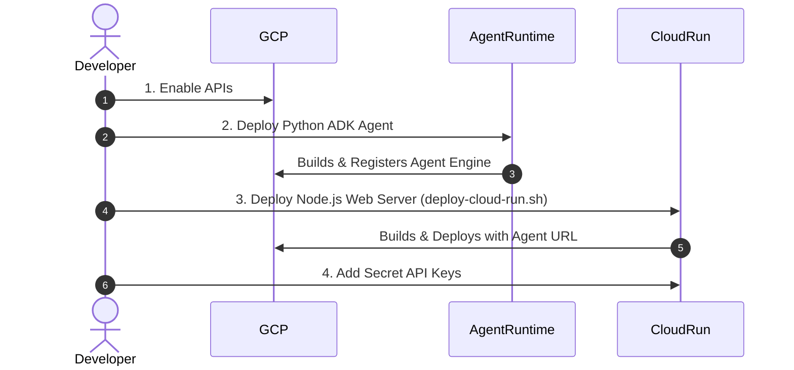

# Cost Management, Cleanup, and From-Scratch Redeployment Guide

This guide ensures you can completely clean up your Google Cloud Platform (GCP) resources to avoid any ongoing or future costs, and spin them back up perfectly in the future using your local files.

---

## Part 1: Future Cost Analysis

While Google Cloud serverless resources (like Cloud Run and Agent Runtime) only charge for active CPU/Memory usage during requests, other assets can incur small but persistent **storage-based costs** even when the game is idle.

### 💰 Potentially Billable Resources
1.  **Artifact Registry Storage (Primary Cost)**:
    *   **Repository**: `life-adventure` (location: `asia-northeast1`) — stores Node.js container builds (~644 MB).
    *   **Repository**: `cloud-run-source-deploy` (location: `us-central1`) — stores cloud build source artifacts.
2.  **Cloud Storage (GCS) Buckets**:
    *   `gs://project-70a4023c-bb6e-491e-aa2_cloudbuild/` — stores Cloud Build logs and intermediate cache archives.
    *   `gs://project-70a4023c-bb6e-491e-aa2-documents/` — stores documents/data.
3.  **Vertex AI Reasoning Engine (Agent Runtime)**:
    *   The deployed ADK orchestrator resource. (Negligible cost when idle, but counts as an active metadata resource).
4.  **Google Cloud Run**:
    *   The deployed Node.js web server. (No cost when idle if minimum instances are set to 0).

---

## Part 2: Step-by-Step Cleanup Guide

Run these commands in your local terminal to delete all resources and stop all billing.

### Step 1: Delete Vertex AI Agent Runtime (Reasoning Engine)
Delete the deployed agent from the Agent Platform registry:
```bash
# Verify the name first
agents-cli deploy --list --project project-70a4023c-bb6e-491e-aa2 --region us-east1

# Delete the Reasoning Engine instance
gcloud ai reasoning-engines delete \
  projects/13327342976/locations/us-east1/reasoningEngines/6954507802706444288 \
  --project=project-70a4023c-bb6e-491e-aa2 \
  --quiet
```

### Step 2: Delete Google Cloud Run Service
Delete the game application server:
```bash
gcloud run services delete life-adventure \
  --region=us-east1 \
  --project=project-70a4023c-bb6e-491e-aa2 \
  --quiet
```

### Step 3: Delete Artifact Registry Repositories
Delete all stored Docker containers to free up registry storage space:
```bash
# Delete the life-adventure repository
gcloud artifacts repositories delete life-adventure \
  --location=asia-northeast1 \
  --project=project-70a4023c-bb6e-491e-aa2 \
  --quiet

# Delete the cloud-run-source-deploy repository
gcloud artifacts repositories delete cloud-run-source-deploy \
  --location=us-central1 \
  --project=project-70a4023c-bb6e-491e-aa2 \
  --quiet
```

### Step 4: Delete Cloud Storage (GCS) Buckets
Delete GCS buckets and all stored files (including Cloud Build caches):
```bash
# Empty and delete the documents bucket
gcloud storage rm -r gs://project-70a4023c-bb6e-491e-aa2-documents/

# Empty and delete the cloudbuild cache bucket
gcloud storage rm -r gs://project-70a4023c-bb6e-491e-aa2_cloudbuild/
```

---

## Part 3: From-Scratch Redeployment Guide

If you have cleaned up everything on GCP, you can redeploy the entire application from scratch using your local workspace files.



### Step 1: Enable Google APIs
Ensure all required Google APIs are active in your GCP project:
```bash
gcloud services enable \
  aiplatform.googleapis.com \
  cloudbuild.googleapis.com \
  cloudresourcemanager.googleapis.com \
  secretmanager.googleapis.com \
  run.googleapis.com \
  artifactregistry.googleapis.com \
  --project=project-70a4023c-bb6e-491e-aa2
```

### Step 2: Deploy the Agent Runtime Backend
Navigate to the agent directory and trigger a fresh deployment:
```bash
cd server/adk_agents

# Run deploy with your API keys mapped as environment variables
agents-cli deploy \
  --project project-70a4023c-bb6e-491e-aa2 \
  --region us-east1 \
  --no-confirm-project \
  --update-env-vars "GEMINI_API_KEY=YOUR_GEMINI_API_KEY,DEEPSEEK_API_KEY=YOUR_DEEPSEEK_API_KEY,AGNES_API_KEY=YOUR_AGNES_API_KEY,AGNES_BASE_URL=https://apihub.agnes-ai.com/v1,AGNES_TEXT_MODEL=agnes-2.0-flash,AGNES_IMAGE_MODEL=agnes-image-2.1-flash,AGNES_VIDEO_MODEL=agnes-video-v2.0,SERVER_URL=http://localhost:3001" \
  --no-wait
```
Check status until it reports `✅ Deployment successful!`:
```bash
agents-cli deploy --status --project project-70a4023c-bb6e-491e-aa2 --region us-east1
```
*Note down the printed `Agent Runtime ID` (e.g. `projects/13327342976/locations/us-east1/reasoningEngines/6954507802706444288`).*

### Step 3: Configure and Deploy Google Cloud Run
1.  Navigate back to the project root:
    ```bash
    cd ../..
    ```
2.  Open `deploy-cloud-run.sh` and make sure the `AGENT_RUNTIME_URL` matches your new Reasoning Engine ID (line 31):
    ```bash
    # Ensure line 31 in deploy-cloud-run.sh targets your new Agent Runtime URL:
    --update-env-vars "NODE_ENV=production,AGENT_RUNTIME_URL=https://us-east1-aiplatform.googleapis.com/reasoningEngines/v1/YOUR_NEW_AGENT_RUNTIME_ID/api"
    ```
3.  Deploy the web server:
    ```bash
    chmod +x deploy-cloud-run.sh
    ./deploy-cloud-run.sh project-70a4023c-bb6e-491e-aa2 us-east1
    ```

### Step 4: Configure API Secrets on Cloud Run
Finally, inject your backend API keys into Cloud Run:
```bash
gcloud run services update life-adventure \
  --region us-east1 \
  --update-env-vars "GEMINI_API_KEY=YOUR_GEMINI_API_KEY,DEEPSEEK_API_KEY=YOUR_DEEPSEEK_API_KEY,AGNES_API_KEY=YOUR_AGNES_API_KEY" \
  --project project-70a4023c-bb6e-491e-aa2
```
Your frontend is now fully deployed and communicating seamlessly with your healthy agent backend!
